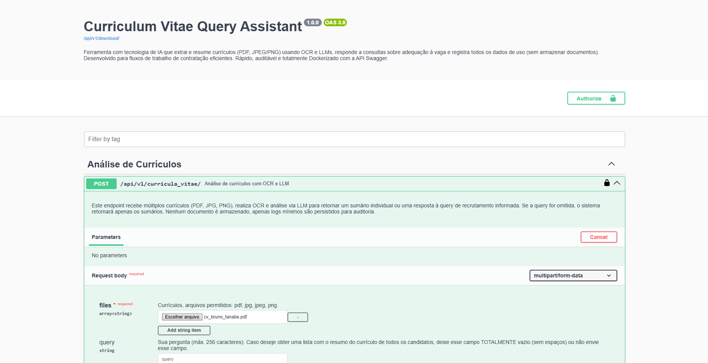

# Curriculum Vitae Query Assistant 📄🤖

Optimize the resume screening process with artificial intelligence! 🚀 The **Curriculum Vitae Query Assistant** is a Python-based application that combines OCR and LLMs to analyze multiple résumés in PDF or image format and provide summaries and intelligent answers to specific recruitment questions. With a well-structured API, interactive documentation via Swagger, and Docker packaging, this solution was created to streamline recruiters’ workflows by automating repetitive tasks and freeing up time for strategic decision-making.


---

## Summary 📋

[Curriculum Vitae Query Assistant 📄🤖](#curriculum-vitae-query-assistant-)  
[Summary 📋](#summary-)  
[1. Description 📖](#1-description-)  
[2. Objectives 🎯](#2-objectives-)  
[3. Key Features ⚙️](#3-key-features-️)  
[4. Main Technologies Used 💻](#4-main-technologies-used-)  
[5. Dependency Structure 📁](#5-dependency-structure-)  
[6. Requirements 🔧](#6-requirements-)  
[7. How to Run? 🏃‍♂️](#7-how-to-run-️)  
[8. Application Screenshots 🖼](#8-application-screenshots-)  
[9. Available Endpoints 🚀](#9-available-endpoints-)  
[10. TODOs 🔮](#10-todos-)  
[11. License 📄](#11-license-)  
[12. How to Contribute? 🤝](#12-how-to-contribute-)  
[13. Author and Contact 👤](#13-author-and-contact-)  
[14. Special Thanks 🌟](#14-special-thanks-)  

---

## 1. Description 📖

Welcome to the **Curriculum Vitae Query Assistant**! This is a RESTful API project built with Python that uses OCR models and large language models to extract information from résumés in PDF or image formats and answer questions based on the document content. The application provides automatic summaries, intelligent insights on the résumés, and logs all interactions in a non-relational database — all in a practical, secure, and scalable way.

---

## 2. Objectives 🎯

* **Screening Automation**: Streamline and accelerate résumé analysis through an intelligent tool.
* **Content-Based Answers**: Enable customized questions about résumés with clear justifications.
* **Documentation and Traceability**: Ensure auditability with logging of every interaction in the system.
* **Ease of Use**: RESTful API interface with well-defined interactive documentation.

---

## 3. Key Features ⚙️

* **Résumé Upload**: Supports multiple files (PDF, JPG, PNG).
* **Extraction and Summarization**: Document OCR with automatic summary generation per résumé.
* **Intelligent Queries**: Custom questions with return of most compatible résumés and justification.
* **Log Records**: Stores request\_id, user\_id, timestamp, query, and result without storing the original document.
* **Interactive Documentation**: Swagger UI for testing and viewing endpoints.

---

## 4. Main Technologies Used 💻

* **Language**: Python 3.13
* **Web Framework**: Django
* **REST API**: Django REST Framework
* **Dependency Injection**: Dependency Injector
* **Text Extraction from Image**: EasyOCR
* **PDF Reading**: PyPDF2
* **Language Model**: Hugging Face Hub (transformers and LLM models)
* **Large Language Model**: meta-llama/Llama-3.1-8B-Instruct
* **API Documentation**: drf-spectacular (Swagger UI)
* **Containerization**: Docker & Docker Compose
* **SQL Database**: SQLite (not yet implemented, but planned for future versions)
* **NoSQL Database**: MongoDB (for usage logs)
* **Dependency Management**: UV Astral
* **Code Formatter**: Black (Development Environment)
* **Import Organizer**: Isort (Development Environment)

---

## 5. Dependency Structure 📁

The project’s dependency structure is organized as follows:

```bash
  curriculum-vitae-query-assistant v1.0.0
  ├── boto3 v1.37.38
  │   ├── botocore v1.37.38
  │   │   ├── jmespath v1.0.1
  │   │   ├── python-dateutil v2.9.0.post0
  │   │   │   └── six v1.17.0
  │   │   └── urllib3 v2.4.0
  │   ├── jmespath v1.0.1
  │   └── s3transfer v0.11.5
  │       └── botocore v1.37.38 (*)
  ├── d v0.2.2
  │   ├── markdown v3.8
  │   ├── pygments v2.19.1
  │   └── pyquery v2.0.1
  │       ├── cssselect v1.3.0
  │       └── lxml v5.3.2
  ├── dependency-injector v4.46.0
  ├── django v5.2
  │   ├── asgiref v3.8.1
  │   └── sqlparse v0.5.3
  ├── django-cors-headers v4.7.0
  │   ├── asgiref v3.8.1
  │   └── django v5.2 (*)
  ├── django-environ v0.12.0
  ├── djangorestframework v3.16.0
  │   └── django v5.2 (*)
  ├── drf-spectacular v0.28.0
  │   ├── django v5.2 (*)
  │   ├── djangorestframework v3.16.0 (*)
  │   ├── inflection v0.5.1
  │   ├── jsonschema v4.23.0
  │   │   ├── attrs v25.3.0
  │   │   ├── jsonschema-specifications v2024.10.1
  │   │   │   └── referencing v0.36.2
  │   │   │       ├── attrs v25.3.0
  │   │   │       └── rpds-py v0.24.0
  │   │   ├── referencing v0.36.2 (*)
  │   │   └── rpds-py v0.24.0
  │   ├── pyyaml v6.0.2
  │   └── uritemplate v4.1.1
  ├── easyocr v1.7.2
  │   ├── ninja v1.11.1.4
  │   ├── numpy v2.2.5
  │   ├── opencv-python-headless v4.11.0.86
  │   │   └── numpy v2.2.5
  │   ├── pillow v11.2.1
  │   ├── pyclipper v1.3.0.post6
  │   ├── python-bidi v0.6.6
  │   ├── pyyaml v6.0.2
  │   ├── scikit-image v0.25.2
  │   │   ├── imageio v2.37.0
  │   │   │   ├── numpy v2.2.5
  │   │   │   └── pillow v11.2.1
  │   │   ├── lazy-loader v0.4
  │   │   │   └── packaging v24.2
  │   │   ├── networkx v3.4.2
  │   │   ├── numpy v2.2.5
  │   │   ├── packaging v24.2
  │   │   ├── pillow v11.2.1
  │   │   ├── scipy v1.15.3
  │   │   │   └── numpy v2.2.5
  │   │   └── tifffile v2025.3.30
  │   │       └── numpy v2.2.5
  │   ├── scipy v1.15.3 (*)
  │   ├── shapely v2.1.0
  │   │   └── numpy v2.2.5
  │   ├── torch v2.7.0
  │   │   ├── filelock v3.18.0
  │   │   ├── fsspec v2025.3.2
  │   │   ├── jinja2 v3.1.6
  │   │   │   └── markupsafe v3.0.2
  │   │   ├── networkx v3.4.2
  │   │   ├── nvidia-cublas-cu12 v12.6.4.1
  │   │   ├── nvidia-cuda-cupti-cu12 v12.6.80
  │   │   ├── nvidia-cuda-nvrtc-cu12 v12.6.77
  │   │   ├── nvidia-cuda-runtime-cu12 v12.6.77
  │   │   ├── nvidia-cudnn-cu12 v9.5.1.17
  │   │   │   └── nvidia-cublas-cu12 v12.6.4.1
  │   │   ├── nvidia-cufft-cu12 v11.3.0.4
  │   │   │   └── nvidia-nvjitlink-cu12 v12.6.85
  │   │   ├── nvidia-cufile-cu12 v1.11.1.6
  │   │   ├── nvidia-curand-cu12 v10.3.7.77
  │   │   ├── nvidia-cusolver-cu12 v11.7.1.2
  │   │   │   ├── nvidia-cublas-cu12 v12.6.4.1
  │   │   │   ├── nvidia-cusparse-cu12 v12.5.4.2
  │   │   │   │   └── nvidia-nvjitlink-cu12 v12.6.85
  │   │   │   └── nvidia-nvjitlink-cu12 v12.6.85
  │   │   ├── nvidia-cusparse-cu12 v12.5.4.2 (*)
  │   │   ├── nvidia-cusparselt-cu12 v0.6.3
  │   │   ├── nvidia-nccl-cu12 v2.26.2
  │   │   ├── nvidia-nvjitlink-cu12 v12.6.85
  │   │   ├── nvidia-nvtx-cu12 v12.6.77
  │   │   ├── setuptools v80.4.0
  │   │   ├── sympy v1.14.0
  │   │   │   └── mpmath v1.3.0
  │   │   ├── triton v3.3.0
  │   │   │   └── setuptools v80.4.0
  │   │   └── typing-extensions v4.13.2
  │   └── torchvision v0.22.0
  │       ├── numpy v2.2.5
  │       ├── pillow v11.2.1
  │       └── torch v2.7.0 (*)
  ├── huggingface-hub v0.31.1
  │   ├── filelock v3.18.0
  │   ├── fsspec v2025.3.2
  │   ├── hf-xet v1.1.0
  │   ├── packaging v24.2
  │   ├── pyyaml v6.0.2
  │   ├── requests v2.32.3
  │   │   ├── certifi v2025.4.26
  │   │   ├── charset-normalizer v3.4.2
  │   │   ├── idna v3.10
  │   │   └── urllib3 v2.4.0
  │   ├── tqdm v4.67.1
  │   └── typing-extensions v4.13.2
  ├── markdown v3.8
  ├── mongoengine v0.29.1
  │   └── pymongo v4.12.1
  │       └── dnspython v2.7.0
  ├── pillow v11.2.1
  ├── psycopg2-binary v2.9.10
  ├── pypdf2 v3.0.1
  ├── black v25.1.0 (extra: development)
  │   ├── click v8.1.8
  │   ├── mypy-extensions v1.0.0
  │   ├── packaging v24.2
  │   ├── pathspec v0.12.1
  │   └── platformdirs v4.3.7
  └── isort v6.0.1 (extra: development)
```

---

## 6. Requirements 🔧

* **Python 3.13**
* **Docker** and **Docker Compose**
* **[Valid credentials for using HuggingFace Hub](https://huggingface.co/playground)**

---

## 7. How to Run? 🏃‍♂️

Follow the steps below to run the project locally.

### 7.1. Using Docker (Recommended)

Make sure you have *Docker* and *Docker Compose* installed on your machine.

#### 7.1.1. Clone the Repository

```bash
  git clone https://github.com/YourUsername/curriculum-vitae-query-assistant.git
  cd curriculum-vitae-query-assistant
```

#### 7.1.2. Set Up the .env File

Before starting the application, you need to configure a `.env` file with your credentials and local settings.
Use the `.env.example` file as a base:

```bash
  cp .env.example .env
```

Then, edit the `.env` file with your credentials:

* MongoDB information
* HuggingFace token (`HUGGINGFACE_ACCESS_TOKEN`)
* Django settings (`DJANGO_SECRET_KEY`, `DJANGO_DEBUG`)
* OCR model name, provider, and LLM model to be used

> **:caution: WARNING** FOR NOW, THE APPLICATION ONLY SUPPORTS THE FOLLOWING CONFIGURATIONS:

```bash
  APPLICATION_LLM_PROVIDER="huggingface"
  APPLICATION_OCR_MODEL="easyocr"
  APPLICATION_LLM_MODEL="meta-llama/Llama-3.1-8B-Instruct"
```

#### 7.1.3. Build and Launch the Containers

```bash
  docker-compose up --build
```

This command:

* Creates and starts the application, MongoDB, and mongo-express containers
* Reads the `.env` file
* Prepares the application with all necessary services to run

#### 7.1.4. Access the API Documentation

After building the containers, you can access the application and the API documentation via Swagger.
The API documentation will be available at: [http://localhost:8000/api/v1/docs/](http://localhost:8000/api/v1/docs/)

#### 7.1.5. View MongoDB Logs

To view MongoDB logs, access mongo-express at: [http://localhost:8081/](http://localhost:8081/) and log in with the credentials you configured in the `.env` file.

---

### 7.2. Running Locally without Docker (Advanced Developers)

If you don’t have Docker installed or prefer to run the application locally, follow the steps below:

#### 7.2.1. Clone the Repository

```bash
  git clone https://github.com/YourUsername/curriculum-vitae-query-assistant.git
  cd curriculum-vitae-query-assistant
```

#### 7.2.2. Create a Virtual Environment

```bash
  python -m venv venv
  source venv/bin/activate  # Linux/Mac
  venv\Scripts\activate     # Windows
```

#### 7.2.3. Install Dependencies

```bash
  pip install -r requirements.txt
```

#### 7.2.4. Set Up the .env File

Before starting the application, you need to configure a `.env` file with your credentials and local settings.
Use the `.env.example` file as a base:

```bash
  cp .env.example .env
```

Then, edit the `.env` file with your credentials:

* MongoDB information
* HuggingFace token (`HUGGINGFACE_ACCESS_TOKEN`)
* Django settings (`DJANGO_SECRET_KEY`, `DJANGO_DEBUG`)
* OCR model name, provider, and LLM model to be used

> **:caution: WARNING** FOR NOW, THE APPLICATION ONLY SUPPORTS THE FOLLOWING CONFIGURATIONS:

```bash
  APPLICATION_LLM_PROVIDER="huggingface"
  APPLICATION_OCR_MODEL="easyocr"
  APPLICATION_LLM_MODEL="meta-llama/Llama-3.1-8B-Instruct"
```

#### 7.2.5. Run Migrations

```bash
  python manage.py migrate
```

#### 7.2.6. Run the Server

```bash
  python manage.py runserver
```

#### 7.2.7. Access the API Documentation

After starting the server, you can access the application and the API documentation via Swagger.
The API documentation will be available at: [http://localhost:8000/api/v1/docs/](http://localhost:8000/api/v1/docs/)

#### 7.2.8. View MongoDB Logs

To view MongoDB logs, you can use mongo-express or access the MongoDB database directly.
Access mongo-express at: [http://localhost:8081/](http://localhost:8081/) and log in with the credentials you configured in the `.env` file.

---

## 8. Application Screenshots 🖼

If the application is running, you can view the API documentation and test the endpoints through Swagger UI (via *drf-spectacular*). Below are some screenshots of the application in action:

### 8.1. Interactive API Documentation 📘



### 8.2. API Responses 📄


---

## 9. Available Endpoints 🚀

> The endpoints below are available at /api/v1/ and documented via Swagger at /api/v1/docs/.

### 9.1 POST Endpoint ➕

* POST /api/v1/curricula\_vitae/: Sends one or more resume files (PDF, JPG, PNG) for analysis.

* Example multipart/form-data payload:

```multipart/form-data
  {
    "files": [
      "curriculo1.pdf",
      "curriculo2.jpg"
    ]
    "query": "Which resumes are most compatible with the Python developer position?"
    "user_id": "123e4567-e89b-12d3-a456-426614174000"
    "request_id": "123e4567-e89b-12d3-a456-426614174000"
  }
```

---

## 10. TODOs 🔮

* Create logic to not exceed the token limit of the LLM request (When there are many resumes) ⚙️
* Implement configuration to use the machine’s GPU for the OCR model 🖥️
* Implement a faster OCR model than EasyOCR, such as Tesseract OCR 🖼️
* Authentication and Authorization via JWT 🔐
* Automated testing with Pytest or unittest 🧪

---

## 11. License 📄

This project is licensed under the MIT License. For more information, read the [LICENSE](LICENSE) file.

---

## 12. How to Contribute? 🤝

Contributions are very welcome! Follow the steps below:

1. Fork the repository.
2. Create a branch for the feature:
   `git checkout -b feature/new-feature`
3. Commit your changes:
   `git commit -m "feat: add new feature"`
4. Push to your remote repository:
   `git push origin feature/new-feature`
5. Open a Pull Request in this repository.

---

## 13. Author and Contact 👤

* *Name*: Bruno Tanabe
* *Email*: [tanabebruno@gmail.com](mailto:tanabebruno@gmail.com)
* *LinkedIn*: [linkedin.com/in/tanabebruno](https://www.linkedin.com/in/tanabebruno/)
* *GitHub*: [github.com/brunotanabe](https://github.com/brunotanabe)
* *Medium*: [medium.com/@tanabebruno](https://medium.com/@tanabebruno)

---

## 14. Special Thanks 🌟

Thanks to [Teddy Open Finance](https://teddydigital.io/) for the opportunity to take part in the technical challenge and develop this project with freedom, creativity, and continuous learning. 🚀

---
