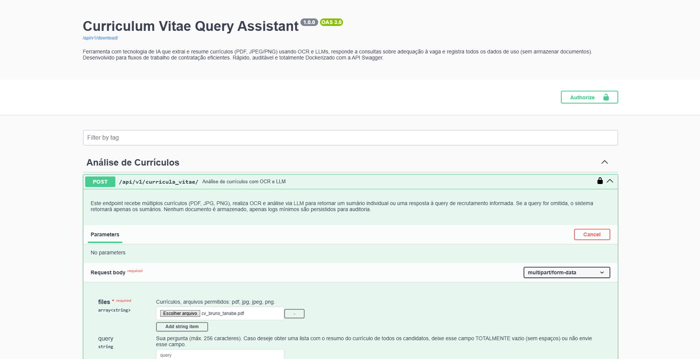
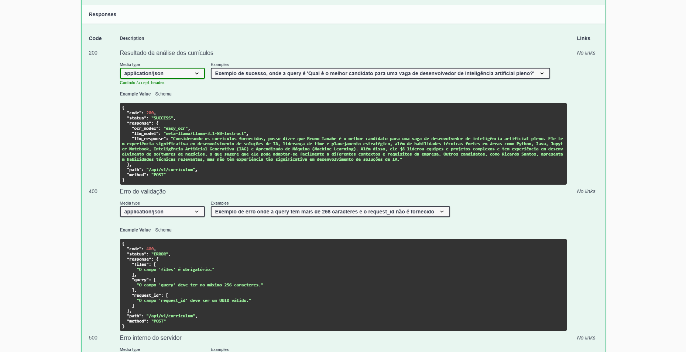

# Curriculum Vitae Query Assistant 📄🤖

Otimize o processo de triagem de currículos com inteligência artificial! 🚀 O **Curriculum Vitae Query Assistant** é uma aplicação desenvolvida em Python que combina OCR e LLMs para analisar múltiplos currículos em PDF ou imagem e fornecer sumários e respostas inteligentes para perguntas específicas de recrutamento. Com uma API bem estruturada, documentação interativa via Swagger e empacotamento com Docker, essa solução foi criada para facilitar a rotina de recrutadores automatizando tarefas repetitivas e liberando tempo para decisões estratégicas.


---

## Sumário 📋

[Curriculum Vitae Query Assistant 📄🤖](#curriculum-vitae-query-assistant-)  
  [Sumário 📋](#sumário-)  
  [1. Descrição 📖](#1-descrição-)  
  [2. Objetivos 🎯](#2-objetivos-)  
  [3. Principais Funcionalidades ⚙️](#3-principais-funcionalidades-️)  
  [4. Principais Tecnologias Utilizadas 💻](#4-principais-tecnologias-utilizadas-)  
  [5. Estrutura das Dependências 📁](#5-estrutura-das-dependências-)  
  [6. Requisitos 🔧](#6-requisitos-)  
  [7. Como Executar? 🏃‍♂️](#7-como-executar-️)  
  [8. Imagens da Aplicação 🖼](#8-imagens-da-aplicação-)  
  [9. Endpoints Disponíveis 🚀](#9-endpoints-disponíveis-)  
  [10. TODOs 🔮](#10-todos-)  
  [11. Licença 📄](#11-licença-)  
  [12. Como Contribuir? 🤝](#12-como-contribuir-)  
  [13. Autor e Contato 👤](#13-autor-e-contato-)  
  [14. Agradecimentos Especiais 🌟](#14-agradecimentos-especiais-)  

---

## 1. Descrição 📖

Bem-vindo ao **Curriculum Vitae Query Assistant**! Este é um projeto de API RESTful criado com Python que utiliza modelos de OCR e grandes modelos de linguagem para extrair informações de currículos em PDF ou imagem e responder perguntas com base no conteúdo dos documentos. A aplicação fornece resumos automáticos, insights inteligentes sobre os currículos e registra logs completos das interações em um banco de dados não relacional — tudo isso de forma prática, segura e escalável.

---

## 2. Objetivos 🎯

- **Automatização de Triagem**: Facilitar e agilizar a análise de currículos por meio de uma ferramenta inteligente.
- **Respostas Baseadas em Conteúdo**: Permitir perguntas personalizadas sobre os currículos com justificativas claras.
- **Documentação e Rastreabilidade**: Garantir auditabilidade com registro de cada interação no sistema.
- **Facilidade de Uso**: Interface via API RESTful bem definida, com documentação interativa.

---

## 3. Principais Funcionalidades ⚙️

- **Upload de Currículos**: Suporte a múltiplos arquivos (PDF, JPG, PNG).
- **Extração e Resumo**: OCR de documentos com geração automática de sumários por currículo.
- **Consultas Inteligentes**: Perguntas personalizadas com retorno de currículos mais compatíveis e justificativa da resposta.
- **Registro de Logs**: Armazena request\_id, user\_id, timestamp, query e resultado sem guardar o documento original.
- **Documentação Interativa**: Swagger UI para testes e visualização dos endpoints.

---

## 4. Principais Tecnologias Utilizadas 💻

- **Linguagem**: Python 3.13
- **Framework Web**: Django
- **API REST**: Django REST Framework
- **Injeção de Dependências**: Dependency Injector
- **Extração de Texto de Imagem**: EasyOCR
- **Leitura de PDFs**: PyPDF2
- **Modelo de Linguagem**: Hugging Face Hub (transformers e modelos LLM)
- **Grande Modelo de Linguagem**: meta-llama/Llama-3.1-8B-Instruct
- **Documentação de API**: drf-spectacular (Swagger UI)
- **Containerização**: Docker & Docker Compose
- **Banco da Dados SQL**: SQLite (ainda não implementado, mas será utilizado nas próximas versões)
- **Banco de Dados NoSQL**: MongoDB (para logs de uso)
- **Gerenciamento de Dependências**: UV Astral
- **Formatador de Código**: Black (Ambiente de Desenvolvimento)
- **Organizador de Imports**: Isort (Ambiente de Desenvolvimento)

---

## 5. Estrutura das Dependências 📁

A estrutura das dependências do projeto é organizada da seguinte forma:

```bash
  curriculum-vitae-query-assistant v1.0.0
  ├── boto3 v1.37.38
  │   ├── botocore v1.37.38
  │   │   ├── jmespath v1.0.1
  │   │   ├── python-dateutil v2.9.0.post0
  │   │   │   └── six v1.17.0
  │   │   └── urllib3 v2.4.0
  │   ├── jmespath v1.0.1
  │   └── s3transfer v0.11.5
  │       └── botocore v1.37.38 (*)
  ├── d v0.2.2
  │   ├── markdown v3.8
  │   ├── pygments v2.19.1
  │   └── pyquery v2.0.1
  │       ├── cssselect v1.3.0
  │       └── lxml v5.3.2
  ├── dependency-injector v4.46.0
  ├── django v5.2
  │   ├── asgiref v3.8.1
  │   └── sqlparse v0.5.3
  ├── django-cors-headers v4.7.0
  │   ├── asgiref v3.8.1
  │   └── django v5.2 (*)
  ├── django-environ v0.12.0
  ├── djangorestframework v3.16.0
  │   └── django v5.2 (*)
  ├── drf-spectacular v0.28.0
  │   ├── django v5.2 (*)
  │   ├── djangorestframework v3.16.0 (*)
  │   ├── inflection v0.5.1
  │   ├── jsonschema v4.23.0
  │   │   ├── attrs v25.3.0
  │   │   ├── jsonschema-specifications v2024.10.1
  │   │   │   └── referencing v0.36.2
  │   │   │       ├── attrs v25.3.0
  │   │   │       └── rpds-py v0.24.0
  │   │   ├── referencing v0.36.2 (*)
  │   │   └── rpds-py v0.24.0
  │   ├── pyyaml v6.0.2
  │   └── uritemplate v4.1.1
  ├── easyocr v1.7.2
  │   ├── ninja v1.11.1.4
  │   ├── numpy v2.2.5
  │   ├── opencv-python-headless v4.11.0.86
  │   │   └── numpy v2.2.5
  │   ├── pillow v11.2.1
  │   ├── pyclipper v1.3.0.post6
  │   ├── python-bidi v0.6.6
  │   ├── pyyaml v6.0.2
  │   ├── scikit-image v0.25.2
  │   │   ├── imageio v2.37.0
  │   │   │   ├── numpy v2.2.5
  │   │   │   └── pillow v11.2.1
  │   │   ├── lazy-loader v0.4
  │   │   │   └── packaging v24.2
  │   │   ├── networkx v3.4.2
  │   │   ├── numpy v2.2.5
  │   │   ├── packaging v24.2
  │   │   ├── pillow v11.2.1
  │   │   ├── scipy v1.15.3
  │   │   │   └── numpy v2.2.5
  │   │   └── tifffile v2025.3.30
  │   │       └── numpy v2.2.5
  │   ├── scipy v1.15.3 (*)
  │   ├── shapely v2.1.0
  │   │   └── numpy v2.2.5
  │   ├── torch v2.7.0
  │   │   ├── filelock v3.18.0
  │   │   ├── fsspec v2025.3.2
  │   │   ├── jinja2 v3.1.6
  │   │   │   └── markupsafe v3.0.2
  │   │   ├── networkx v3.4.2
  │   │   ├── nvidia-cublas-cu12 v12.6.4.1
  │   │   ├── nvidia-cuda-cupti-cu12 v12.6.80
  │   │   ├── nvidia-cuda-nvrtc-cu12 v12.6.77
  │   │   ├── nvidia-cuda-runtime-cu12 v12.6.77
  │   │   ├── nvidia-cudnn-cu12 v9.5.1.17
  │   │   │   └── nvidia-cublas-cu12 v12.6.4.1
  │   │   ├── nvidia-cufft-cu12 v11.3.0.4
  │   │   │   └── nvidia-nvjitlink-cu12 v12.6.85
  │   │   ├── nvidia-cufile-cu12 v1.11.1.6
  │   │   ├── nvidia-curand-cu12 v10.3.7.77
  │   │   ├── nvidia-cusolver-cu12 v11.7.1.2
  │   │   │   ├── nvidia-cublas-cu12 v12.6.4.1
  │   │   │   ├── nvidia-cusparse-cu12 v12.5.4.2
  │   │   │   │   └── nvidia-nvjitlink-cu12 v12.6.85
  │   │   │   └── nvidia-nvjitlink-cu12 v12.6.85
  │   │   ├── nvidia-cusparse-cu12 v12.5.4.2 (*)
  │   │   ├── nvidia-cusparselt-cu12 v0.6.3
  │   │   ├── nvidia-nccl-cu12 v2.26.2
  │   │   ├── nvidia-nvjitlink-cu12 v12.6.85
  │   │   ├── nvidia-nvtx-cu12 v12.6.77
  │   │   ├── setuptools v80.4.0
  │   │   ├── sympy v1.14.0
  │   │   │   └── mpmath v1.3.0
  │   │   ├── triton v3.3.0
  │   │   │   └── setuptools v80.4.0
  │   │   └── typing-extensions v4.13.2
  │   └── torchvision v0.22.0
  │       ├── numpy v2.2.5
  │       ├── pillow v11.2.1
  │       └── torch v2.7.0 (*)
  ├── huggingface-hub v0.31.1
  │   ├── filelock v3.18.0
  │   ├── fsspec v2025.3.2
  │   ├── hf-xet v1.1.0
  │   ├── packaging v24.2
  │   ├── pyyaml v6.0.2
  │   ├── requests v2.32.3
  │   │   ├── certifi v2025.4.26
  │   │   ├── charset-normalizer v3.4.2
  │   │   ├── idna v3.10
  │   │   └── urllib3 v2.4.0
  │   ├── tqdm v4.67.1
  │   └── typing-extensions v4.13.2
  ├── markdown v3.8
  ├── mongoengine v0.29.1
  │   └── pymongo v4.12.1
  │       └── dnspython v2.7.0
  ├── pillow v11.2.1
  ├── psycopg2-binary v2.9.10
  ├── pypdf2 v3.0.1
  ├── black v25.1.0 (extra: development)
  │   ├── click v8.1.8
  │   ├── mypy-extensions v1.0.0
  │   ├── packaging v24.2
  │   ├── pathspec v0.12.1
  │   └── platformdirs v4.3.7
  └── isort v6.0.1 (extra: development)
```

---

## 6. Requisitos 🔧

- **Python 3.13**
- **Docker** e **Docker Compose**.
- **[Credenciais válidas para uso do HuggingFace Hub](https://huggingface.co/playground)**

---

## 7. Como Executar? 🏃‍♂️

Siga os passos abaixo para executar o projeto localmente.

### 7.1. Utilizando Docker (Recomendado)

Certifique-se de que você tenha o *Docker* e o *Docker Compose* instalados na sua máquina.

#### 7.1.1. Clonar o Repositório

```bash
  git clone https://github.com/SeuUsuario/curriculum-vitae-query-assistant.git
  cd curriculum-vitae-query-assistant
```

#### 7.1.2. Configurar o Arquivo .env

Antes de iniciar a aplicação, você precisa configurar um arquivo .env com suas credenciais e configurações locais.
Use o arquivo .env.example como base:

```bash
  cp .env.example .env
```

Em seguida, edite o .env com suas credenciais:

- Informações do MongoDB.
- Token do HuggingFace (HUGGINGFACE_ACCESS_TOKEN).
- Configurações do Django (DJANGO_SECRET_KEY, DJANGO_DEBUG).
- Nome do modelo OCR, provedor e modelo LLM que será utilizado.

> **:caution: ATENÇÃO** POR ENQUANTO A APLICAÇÃO SUPORTA APENAS AS SEGUINTES CONFIGURAÇÕES:

```bash
  APPLICATION_LLM_PROVIDER="huggingface"
  APPLICATION_OCR_MODEL="easyocr"
  APPLICATION_LLM_MODEL="meta-llama/Llama-3.1-8B-Instruct"
```

#### 7.1.3. Construir e Subir os Containers

```bash
  docker-compose up --build
```

Este comando:

- Cria e inicia o container da aplicação, MongoDB e mongo-express.
- Realiza a leitura do arquivo .env.
- Prepara a aplicação com todos os serviços necessários para funcionar.

#### 7.1.4. Acessar a documentação da API

Após a construção dos containers, você pode acessar a aplicação e a documentação da API via Swagger.
A documentação da API estará disponível em: [http://localhost:8000/api/v1/docs/](http://localhost:8000/api/v1/docs/).

#### 7.1.5. Ver Logs do MongoDB

Para visualizar os logs do MongoDB, acesse o mongo-express em: [http://localhost:8081/](http://localhost:8081/) e logue-se com as credenciais que você configurou no arquivo .env.

---

### 7.2. Executando Localmente sem Docker (Desenvolvedores Avançados)

Caso você não tenha o Docker instalado ou prefira executar a aplicação localmente, siga os passos abaixo:

#### 7.2.1. Clonar o Repositório

```bash
  git clone https://github.com/SeuUsuario/curriculum-vitae-query-assistant.git
  cd curriculum-vitae-query-assistant
```

#### 7.2.2. Criar um Ambiente Virtual

```bash
  python -m venv venv
  source venv/bin/activate  # Linux/Mac
  venv\Scripts\activate     # Windows
```

#### 7.2.3. Instalar Dependências

```bash
  pip install -r requirements.txt
```

#### 7.2.4. Configurar o Arquivo .env

Antes de iniciar a aplicação, você precisa configurar um arquivo .env com suas credenciais e configurações locais.

Use o arquivo .env.example como base:

```bash
  cp .env.example .env
```

Em seguida, edite o .env com suas credenciais:

- Informações do MongoDB.
- Token do HuggingFace (HUGGINGFACE_ACCESS_TOKEN).
- Configurações do Django (DJANGO_SECRET_KEY, DJANGO_DEBUG).
- Nome do modelo OCR, provedor e modelo LLM que será utilizado.

> **:caution: ATENÇÃO** POR ENQUANTO A APLICAÇÃO SUPORTA APENAS AS SEGUINTES CONFIGURAÇÕES:

```bash
  APPLICATION_LLM_PROVIDER="huggingface"
  APPLICATION_OCR_MODEL="easyocr"
  APPLICATION_LLM_MODEL="meta-llama/Llama-3.1-8B-Instruct"
```

#### 7.2.5. Executar as Migrações

```bash
  python manage.py migrate
```

#### 7.2.6. Executar o Servidor

```bash
  python manage.py runserver
```

#### 7.2.7. Acessar a documentação da API

Após iniciar o servidor, você pode acessar a aplicação e a documentação da API via Swagger.
A documentação da API estará disponível em: [http://localhost:8000/api/v1/docs/](http://localhost:8000/api/v1/docs/).

#### 7.2.8. Ver Logs do MongoDB

Para visualizar os logs do MongoDB, você pode usar o mongo-express ou acessar diretamente o banco de dados MongoDB.
Acesse o mongo-express em: [http://localhost:8081/](http://localhost:8081/) e logue-se com as credenciais que você configurou no arquivo .env.

---

## 8. Imagens da Aplicação 🖼

Caso a aplicação esteja em execução, você poderá visualizar a documentação da API e testar os endpoints através do Swagger UI (via *drf-spectacular*). Abaixo estão algumas capturas de tela da aplicação em funcionamento:

### 8.1. Documentação Interativa da API 📘



### 8.2. Respostas da API 📄



---

## 9. Endpoints Disponíveis 🚀

> Os endpoints abaixo estão disponíveis em /api/v1/ e documentados via Swagger em /api/v1/docs/.

### 9.1 Endpoint POST ➕

- POST /api/v1/curricula_vitae/: Envia um ou mais arquivos de currículo (PDF, JPG, PNG) para análise.

- Exemplo de payload multipart/form-data:

```multipart/form-data
  {
    "files": [
      "curriculo1.pdf",
      "curriculo2.jpg"
    ]
    "query": "Quais currículos são mais compatíveis com a vaga de desenvolvedor Python?"
    "user_id": "123e4567-e89b-12d3-a456-426614174000"
    "request_id": "123e4567-e89b-12d3-a456-426614174000"
  }
```

---

## 10. TODOs 🔮

- Implementação de configuração para utilizar o modelo de OCR com a placa de vídeo (GPU) da máquina. 🖥️
- Implementação de um modelo de OCR mais rápido que o EasyOCR, como o Tesseract OCR. 🖼️
- Autenticação e Autorização via JWT 🔐
- Testes automatizados com Pytest ou unittest 🧪

---

## 11. Licença 📄

Este projeto está licenciado sob a Licença MIT. Para mais informações, leia o arquivo [LICENSE](LICENSE).

---

## 12. Como Contribuir? 🤝

Contribuições são muito bem-vindas! Siga os passos abaixo:

1. Faça um *fork* do repositório.
2. Crie uma branch para a feature:
   git checkout -b feature/nova-feature
3. Faça o commit das alterações:
   git commit -m "feat: adiciona nova feature"
4. Faça o push para o seu repositório remoto:
   git push origin feature/nova-feature
5. Abra um Pull Request neste repositório.

---

## 13. Autor e Contato 👤

- *Nome*: Bruno Tanabe
- *Email*: [tanabebruno@gmail.com](mailto:tanabebruno@gmail.com)
- *LinkedIn*: [linkedin.com/in/tanabebruno](https://www.linkedin.com/in/tanabebruno/)
- *GitHub*: [github.com/brunotanabe](https://github.com/brunotanabe)
- Medium: [medium.com/@tanabebruno](https://medium.com/@tanabebruno)

---

## 14. Agradecimentos Especiais 🌟

Agradeço à [Teddy Open Finance](https://teddydigital.io/) pela oportunidade de participar do desafio técnico e desenvolver este projeto com liberdade, criatividade e aprendizado contínuo. 🚀

---
